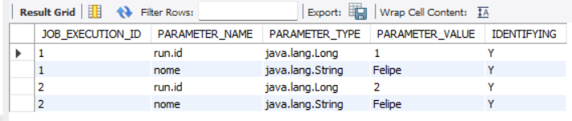

# Estudos sobre Spring Batch: 

<h1 align="center">
<a href="https://spring.io/projects/spring-batch"> Documentação oficial</a>
</h1>

# Scripts executados no Mysql
# Selecionar banco de dados
```
use spring_batch
```

# Exibir tabelas atreladas ao banco de dados
```
show tables;
```

<p align="center">
  
</p>


# Quantas vezes o batch foi executado com sucesso?
```
select * from batch_job_instance;
```

<p align="center">
  
</p>

# Quantas vezes o batch foi executado no total (sucesso + falha)?
# Apresenta duração e status
```
select * from batch_job_execution;
```

<p align="center">
  
</p>

# Quais dados foram salvos no contexto de execução do job
```
select * from batch_job_execution_context;
```
<p align="center">
  
</p>

# Quais step execution foram executados
```
select * from batch_step_execution;
```
<p align="center">
  
</p>


# Quais informações especificas do step importantes para identificar a lógica
```
select * from batch_step_execution_context;
```
<p align="center">
  
</p>

# Informar para cada execução, qual parametros foi utilizado
```
select * from batch_job_execution_params;
```
<p align="center">
  
</p>

# Limpar metadados springbatch
```
delete from batch_job_execution_context;
delete from batch_job_execution_params;
delete from batch_job_execution_seq;

delete from batch_step_execution_context;
delete from batch_step_execution_seq;
delete from batch_step_execution;

delete from batch_job_execution;
delete from batch_job_instance;
delete from batch_job_seq;
```

# Caso receba o erro
```
delete from batch_job_execution_seq where UNIQUE_KEY = 0	Error Code: 1175.
```

## 1. Adicione uma cláusula WHERE com uma coluna de chave:

Certifique-se de incluir uma cláusula WHERE em sua instrução DELETE que use uma coluna de chave primária ou única para garantir que apenas as linhas desejadas sejam afetadas.

## 2. Desative o modo de atualização segura:

Siga as instruções mencionadas anteriormente para desativar o modo de atualização segura nas preferências do MySQL Workbench.

* Acesse "Edit" no menu superior.
* Escolha "Preferences".
* Vá para "SQL Editor" na barra lateral esquerda.
* Desmarque a opção "Safe Updates (rejects UPDATEs and DELETEs with no restrictions)".
* Clique em "OK" e reconecte-se ao banco de dados.