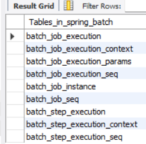
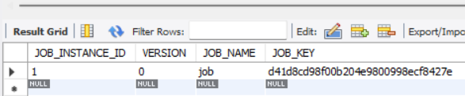
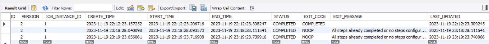
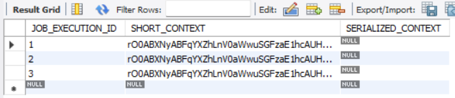
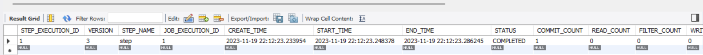
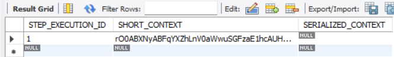

# Estudos sobre Spring Batch: 

<h1 align="center">
<a href="https://spring.io/projects/spring-batch"> Documentação oficial</a>
</h1>

# Scripts executados no Mysql
# Selecionar banco de dados
```
use spring_batch
```

# Exibir tabelas atreladas ao banco de dados
```
show tables;
```

<p align="center">
  
</p>


# Quantas vezes o batch foi executado com sucesso?
```
select * from batch_job_instance;
```

<p align="center">
  
</p>

# Quantas vezes o batch foi executado no total (sucesso + falha)?
# Apresenta duração e status
```
select * from batch_job_execution;
```

<p align="center">
  
</p>

# Quais dados foram salvos no contexto de execução do job
```
select * from batch_job_execution_context;
```
<p align="center">
  
</p>

# Quais step execution foram executados
```
select * from batch_step_execution;
```
<p align="center">
  
</p>


# Quais informações especificas do step importantes para identificar a lógica
```
select * from batch_step_execution_context;
```
<p align="center">
  
</p>
